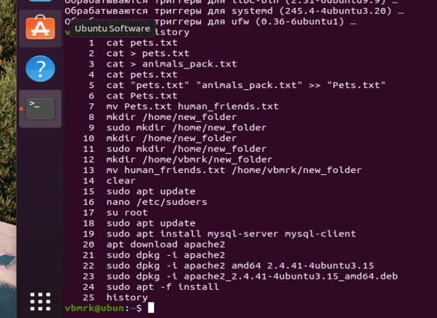
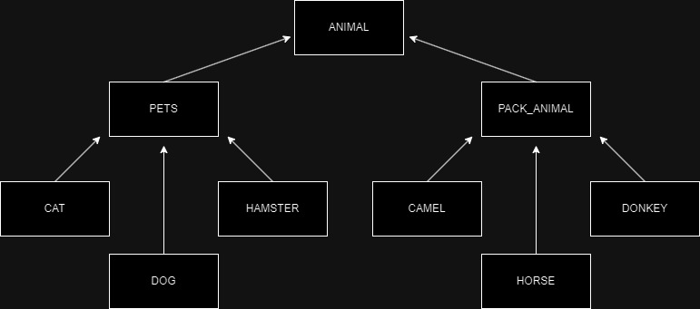

# Задание  

### 1. Используя команду cat в терминале операционной системы Linux, создать два файла Домашние животные (заполнив файл собаками, кошками, хомяками) и Вьючные животными заполнив файл Лошадьми, верблюдами и ослы, а затем объединить их. Просмотреть содержимое созданного файла. Переименовать файл, дав ему новое имя (Друзья человека). 

*cat > pets.txt* 
*cat > animals_pack.txt*
*cat > “pets.txt” “animals_pack.txt” >> “Pets.txt”* 

#### Результат команд 

Dog Bob  
Dog Fob  
Cat Whisler  
Cat Digsler  
Hamster Og  
Horse War  
Horse Storm  
Camel Calem  
Camel Malek  
Donkey Shrek 

 
#### Переименовать файл, дав ему новое имя (Друзья человека).

*mv Pets.txt human_friends.txt* 

 
### 2. Создать директорию, переместить файл туда. 

*mkdir /home/vbmrk/new_folder* 
*mv human_friends.txt /home/vbmrk/new_folder* 

 
### 3. Подключить дополнительный репозиторий MySQL. Установить любой пакет из этого репозитория. 

*sudo apt update* 
*sudo apt install mysql-server mysql-client* 

 
### 4. Установить и удалить deb-пакет с помощью dpkg. 

*sudo dpkg –i apache2_2.4.41-4ubuntu3.15_amd64.deb* 
*sudo apt –f install*

### 5. Выложить историю команд в терминале ubuntu



### 6. Нарисовать диаграмму, в которой есть класс родительский класс, домашние
животные и вьючные животные, в составы которых в случае домашних
животных войдут классы: собаки, кошки, хомяки, а в класс вьючные животные
войдут: Лошади, верблюды и ослы.



### 7. В подключенном MySQL репозитории создать базу данных “Друзья человека”

```
CREATE DATABASE humans_friend;

USE humans_friend;
```
### 8. Создать таблицы с иерархией из диаграммы в БД

```
CREATE TABLE IF NOT EXISTS animal (
	id_animal INT AUTO_INCREMENT PRIMARY KEY NOT NULL,
    animal_type VARCHAR(20) NOT NULL
);

CREATE TABLE IF NOT EXISTS pets (
	id_pets INT AUTO_INCREMENT PRIMARY KEY NOT NULL,
    views VARCHAR(20) NOT NULL,
    animal_types INT NOT NULL,
    FOREIGN KEY (animal_type) REFERENCES animal (id_animal) ON UPDATE CASCADE
);

CREATE TABLE IF NOT EXISTS pack_animal (
	id_pack_animal INT AUTO_INCREMENT PRIMARY KEY NOT NULL,
    views VARCHAR(20) NOT NULL,
    animal_type INT NOT NULL,
    FOREIGN KEY (animal_type) REFERENCES animal (id_animal) ON UPDATE CASCADE
);

CREATE TABLE IF NOT EXISTS dog (
	id_dog INT AUTO_INCREMENT PRIMARY KEY NOT NULL,
    name_dog VARCHAR(30) NOT NULL,
    commands VARCHAR(100),
    birthday DATE,
    animal_kind INT,
    FOREIGN KEY (animal_kind) REFERENCES pets (id_pets) ON UPDATE CASCADE
);

CREATE TABLE IF NOT EXISTS cat (
	id_cat INT AUTO_INCREMENT PRIMARY KEY NOT NULL,
    name_cat VARCHAR(30) NOT NULL,
    commands VARCHAR(100),
    birthday DATE,
	animal_kind INT,
    FOREIGN KEY (animal_kind) REFERENCES pets (id_pets) ON UPDATE CASCADE
);

CREATE TABLE IF NOT EXISTS hamster (
	id_hamster INT AUTO_INCREMENT PRIMARY KEY NOT NULL,
    name_hamster VARCHAR(30) NOT NULL,
    commands VARCHAR(100),
    birthday DATE,
    animal_kind INT,
    FOREIGN KEY (animal_kind) REFERENCES pets (id_pets) ON UPDATE CASCADE
);

CREATE TABLE IF NOT EXISTS horse (
	id_horse INT AUTO_INCREMENT PRIMARY KEY NOT NULL,
    name_horse VARCHAR(30) NOT NULL,
    commands VARCHAR(100),
    birthday DATE,
    animal_kind INT,
    FOREIGN KEY (animal_kind) REFERENCES pack_animal (id_pack_animal) ON UPDATE CASCADE
);

CREATE TABLE IF NOT EXISTS donkey (
	id_donkey INT AUTO_INCREMENT PRIMARY KEY NOT NULL,
    name_donkey VARCHAR(30) NOT NULL,
    commands VARCHAR(100),
    birthday DATE,
    animal_kind INT,
    FOREIGN KEY (animal_kind) REFERENCES pack_animal (id_pack_animal) ON UPDATE CASCADE
);

CREATE TABLE IF NOT EXISTS camel (
	id_camel INT AUTO_INCREMENT PRIMARY KEY NOT NULL,
    name_camel VARCHAR(30) NOT NULL,
    commands VARCHAR(100),
    birthday DATE,
    animal_kind INT,
    FOREIGN KEY (animal_kind) REFERENCES pack_animal (id_pack_animal) ON UPDATE CASCADE
);
```
### 9. Заполнить низкоуровневые таблицы именами(животных), командами которые они выполняют и датами рождения

```
INSERT INTO animal (animal_type) VALUES 
	("Pets"),
    ("Pack animals")
;
INSERT INTO pets (views, animal_type) VALUES 
	("Dogs", (SELECT id_animal FROM animal WHERE animal_type = "Pets")),
    ("Cats", (SELECT id_animal FROM animal WHERE animal_type = "Pets")),
    ("Hamsters", (SELECT id_animal FROM animal WHERE animal_type = "Pets"))
;
INSERT INTO pack_animal (views, animal_type) VALUES 
	("Horses", (SELECT id_animal FROM animal WHERE animal_type = "Pack animals")),
    ("Camels", (SELECT id_animal FROM animal WHERE animal_type = "Pack animals")),
    ("Donkeys", (SELECT id_animal FROM animal WHERE animal_type = "Pack animals"))
;


INSERT INTO dog (name_dog, commands, birthday, animal_kind) VALUES 
	("mollitia", "Et ut voluptate libero consequatur.", "1990-04-17", (SELECT id_pets FROM pets WHERE views = "Dogs")),
    ("expedita", "Qui rerum repudiandae qui nu", "1970-04-03", (SELECT id_pets FROM pets WHERE views = "Dogs")),
    ("soluta", "Laborum non possimus cupidi", "2015-10-27", (SELECT id_pets FROM pets WHERE views = "Dogs")),
    ("quisquam", "Saepe ullam quia et.", "1994-03-19", (SELECT id_pets FROM pets WHERE views = "Dogs")),
    ("ea", "Nisi amet qui tenetur magni aut et", "1979-03-21", (SELECT id_pets FROM pets WHERE views = "Dogs"))
;
INSERT INTO cat (name_cat, commands, birthday, animal_kind) VALUES 
	("necessitatibus", "Neque esse voluptatum", "2000-07-22", (SELECT id_pets FROM pets WHERE views = "Cats")),
    ("dicta", "Deserunt minima hic aut", "1981-01-13", (SELECT id_pets FROM pets WHERE views = "Cats")),
    ("error", "Nemo non voluptates amet", "1985-01-07", (SELECT id_pets FROM pets WHERE views = "Cats")),
    ("voluptatum", "Quis dolores sint debitis enim", "1993-10-22", (SELECT id_pets FROM pets WHERE views = "Cats")),
    ("sapiente", "Velit ut molestiae iure conse", "1974-10-06", (SELECT id_pets FROM pets WHERE views = "Cats"))
;
INSERT INTO hamster (name_hamster, commands, birthday, animal_kind) VALUES 
	("laudantium", "Provident facilis magni conse", "2010-05-13", (SELECT id_pets FROM pets WHERE views = "Hamsters")),
    ("rerum", "Et voluptate quae officiis.", "2018-12-25", (SELECT id_pets FROM pets WHERE views = "Hamsters")),
    ("et", "Aut ea voluptas reiciendis", "1970-06-20", (SELECT id_pets FROM pets WHERE views = "Hamsters")),
    ("nihil", "Qui corporis ipsa et ", "1971-10-14", (SELECT id_pets FROM pets WHERE views = "Hamsters")),
    ("praesentium", "Aliquam ab sunt qui quia", "1983-09-05", (SELECT id_pets FROM pets WHERE views = "Hamsters"))
;
INSERT INTO horse (name_horse, commands, birthday, animal_kind) VALUES 
	("possimus", "Corrupti atque libero", "2007-07-27", (SELECT id_pack_animal FROM pack_animal WHERE views = "Horses")),
    ("alias", "Saepe exercitationem est", "2001-08-12", (SELECT id_pack_animal FROM pack_animal WHERE views = "Horses")),
    ("et", "Cumque occaecati minus", "1980-12-26", (SELECT id_pack_animal FROM pack_animal WHERE views = "Horses")),
    ("dolor", "Voluptatem provident exceptu", "2014-02-02", (SELECT id_pack_animal FROM pack_animal WHERE views = "Horses")),
    ("iusto", "Quasi accusamus accusantiu", "1972-05-24", (SELECT id_pack_animal FROM pack_animal WHERE views = "Horses"))
;
INSERT INTO donkey (name_donkey, commands, birthday, animal_kind) VALUES 
	("rerum", "Nostrum laboriosam quam", "1990-10-13", (SELECT id_pack_animal FROM pack_animal WHERE views = "Donkeys")),
    ("odit", "Mollitia tempore autem culpa", "2006-12-28", (SELECT id_pack_animal FROM pack_animal WHERE views = "Donkeys")),
    ("et", "Dignissimos et id ipsum distinct", "2009-09-22", (SELECT id_pack_animal FROM pack_animal WHERE views = "Donkeys")),
    ("velit", "Magnam similique laborum", "2019-02-11", (SELECT id_pack_animal FROM pack_animal WHERE views = "Donkeys")),
    ("ratione", "Commodi neque deleniti", "1995-06-21", (SELECT id_pack_animal FROM pack_animal WHERE views = "Donkeys"))
;
INSERT INTO camel (name_camel, commands, birthday, animal_kind) VALUES 
	("voluptatem", "Sunt assumenda id aut dolor", "1976-04-04", (SELECT id_pack_animal FROM pack_animal WHERE views = "Camels")),
    ("molestias", "Aut optio omnis quam aut", "2023-04-15", (SELECT id_pack_animal FROM pack_animal WHERE views = "Camels")),
    ("voluptatem", "Est autem dolores dolore at", "2019-02-20", (SELECT id_pack_animal FROM pack_animal WHERE views = "Camels")),
    ("fuga", "A voluptatem nihil sequi non", "2007-03-22", (SELECT id_pack_animal FROM pack_animal WHERE views = "Camels")),
    ("blanditiis", "Nobis porro nam beatae", "2006-05-19", (SELECT id_pack_animal FROM pack_animal WHERE views = "Camels"))
;
```

### 10. Удалив из таблицы верблюдов, т.к. верблюдов решили перевезти в другой питомник на зимовку. Объединить таблицы лошади, и ослы в одну таблицу.

```
DROP TABLE camel;
SELECT * FROM horse UNION SELECT * FROM donkey;
```

### 11.Создать новую таблицу “молодые животные” в которую попадут все животные старше 1 года, но младше 3 лет и в отдельном столбце с точностью до месяца подсчитать возраст животных в новой таблице

```
CREATE TABLE young_animal AS (
SELECT *, TIMESTAMPDIFF(MONTH, birthday, NOW()) AS ages
FROM 
	(SELECT name_dog, commands, birthday, p.views, a.animal_type FROM dog AS d LEFT JOIN pets AS p ON d.animal_kind = p.id_pets LEFT JOIN animal AS a ON p.animal_type = a.id_animal UNION
	SELECT name_cat, commands, birthday, p.views, a.animal_type FROM cat AS c LEFT JOIN pets AS p ON c.animal_kind = p.id_pets LEFT JOIN animal AS a ON p.animal_type = a.id_animal UNION
	SELECT name_hamster, commands, birthday, p.views, a.animal_type FROM hamster AS h LEFT JOIN pets AS p ON h.animal_kind = p.id_pets LEFT JOIN animal AS a ON p.animal_type = a.id_animal UNION
	SELECT name_horse, commands, birthday, pa.views, a.animal_type FROM horse AS h LEFT JOIN pack_animal AS pa ON h.animal_kind = pa.id_pack_animal LEFT JOIN animal AS a ON pa.animal_type = a.id_animal UNION
	SELECT name_donkey, commands, birthday, pa.views, a.animal_type FROM donkey AS d LEFT JOIN pack_animal AS pa ON d.animal_kind = pa.id_pack_animal LEFT JOIN animal AS a ON pa.animal_type = a.id_animal)
 AS tmp
 HAVING ages BETWEEN 12 AND 36);
 ```

### 12. Объединить все таблицы в одну, при этом сохраняя поля, указывающие на прошлую принадлежность к старым таблицам.

```
CREATE TABLE all_animals AS
(SELECT name_dog, commands, birthday, p.views, a.animal_type FROM dog AS d LEFT JOIN pets AS p ON d.animal_kind = p.id_pets LEFT JOIN animal AS a ON p.animal_type = a.id_animal UNION
	SELECT name_cat, commands, birthday, p.views, a.animal_type FROM cat AS c LEFT JOIN pets AS p ON c.animal_kind = p.id_pets LEFT JOIN animal AS a ON p.animal_type = a.id_animal UNION
	SELECT name_hamster, commands, birthday, p.views, a.animal_type FROM hamster AS h LEFT JOIN pets AS p ON h.animal_kind = p.id_pets LEFT JOIN animal AS a ON p.animal_type = a.id_animal UNION
	SELECT name_horse, commands, birthday, pa.views, a.animal_type FROM horse AS h LEFT JOIN pack_animal AS pa ON h.animal_kind = pa.id_pack_animal LEFT JOIN animal AS a ON pa.animal_type = a.id_animal UNION
	SELECT name_donkey, commands, birthday, pa.views, a.animal_type FROM donkey AS d LEFT JOIN pack_animal AS pa ON d.animal_kind = pa.id_pack_animal LEFT JOIN animal AS a ON pa.animal_type = a.id_animal);
```

### 13.Создать класс с Инкапсуляцией методов и наследованием по диаграмме.
### 14. Написать программу, имитирующую работу реестра домашних животных.
#### В программе должен быть реализован следующий функционал:
#### 14.1 Завести новое животное
#### 14.2 определять животное в правильный класс
#### 14.3 увидеть список команд, которое выполняет животное
#### 14.4 обучить животное новым командам
#### 14.5 Реализовать навигацию по меню
#### 15.Создайте класс Счетчик, у которого есть метод add(), увеличивающий̆ значение внутренней̆ int переменной̆на 1 при нажатие “Завести новое животное” Сделайте так, чтобы с объектом такого типа можно было работать в блоке try-with-resources. Нужно бросить исключение, если работа с объектом типа счетчик была не в ресурсном try и/или ресурс остался открыт. Значение считать в ресурсе try, если при заведения животного заполнены все поля.

